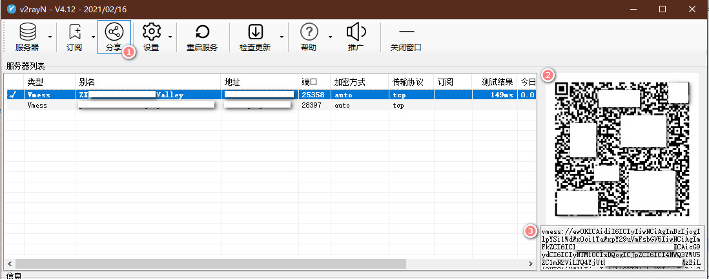

v2ray搭建及使用指南


## 简介

v2ray官网: https://github.com/v2fly/v2ray-core
v2ray官方文档: https://www.v2fly.org/


## v2ray服务端搭建

通过在外网服务器或vps安装并配置服务端程序，我们可以在GFW内网连接该服务器实现网络代理。

常见的价格比较廉价的服务器有:

- vultr: https://www.vultr.com/
- Just My Socks: https://justmysocks11.com/


如果服务器不开启防火墙，或者直接关闭防火墙，那下一步忽略即可。

```
//关闭防火墙
systemctl stop firewalld
//关闭防火墙开机启动
systemctl disable firewalld
```


#添加开放端口

firewall-cmd --zone=public --add-port=25358/tcp --permanent
firewall-cmd --zone=public --add-port=25358/udp --permanent

#删除开放端口(需要删除时再操作)
firewall-cmd --zone=public --remove-port=25358/tcp --permanent
firewall-cmd --zone=public --remove-port=25358/udp --permanent

#修改后必须重新加载
firewall-cmd --reload

#重启防火墙生效
systemctl restart firewalld.service

#查看开放端口列表
firewall-cmd --zone=public --list-ports


## 安装

v2fly官网提供了一键安装脚本，主要功能是下载文件，并创建系统systemd服务。

按照github(https://github.com/v2fly/fhs-install-v2ray)的文档操作即可.

对于做代理的服务器一定是能连接外网的，所以我们使用快速安装脚本即可。

```shell
// 安装可执行文件和 .dat 数据文件
# bash <(curl -L https://raw.githubusercontent.com/v2fly/fhs-install-v2ray/master/install-release.sh)
```

下面两条可以在数据跟新时使用或者卸载使用。
```shell
// 只更新 .dat 数据文件
# bash <(curl -L https://raw.githubusercontent.com/v2fly/fhs-install-v2ray/master/install-dat-release.sh)
// 移除 V2Ray
# bash <(curl -L https://raw.githubusercontent.com/v2fly/fhs-install-v2ray/master/install-release.sh) --remove
```

## 获取UUID

最简单的办法是使用linux自带的工具:
```shell
# cat /proc/sys/kernel/random/uuid
d47f041c-0054-4789-b1b8-9fa161c235c0
```


## 修改配置文件

```shell
# cat /usr/local/etc/v2ray/config.json
{
    "inbounds": [{
        "port": 25358,
        "protocol": "vmess",
        "settings": {
            "clients": [{
                "id": "d47f041c-0054-4789-b1b8-9fa161c235c0"
            }]
        }
    }],
    "outbounds": [{
        "protocol": "freedom"
    }]
}
```

## 设置开机启动

```shell
systemctl enable v2ray.service
```


## 启动

```shell
systemctl start v2ray.service
```

UI客户端使用:
Windows: https://github.com/2dust/v2rayN





Mac: https://github.com/yanue/V2rayU
安卓: https://github.com/2dust/v2rayNG
Linux(GUI): https://github.com/jiangxufeng/v2rayL

跨平台UI客户端: https://github.com/Qv2ray/Qv2ray

命令行客户端:
v2ray-core既是服务端也是客户端，github的Release列表里可以下载数十种平台的绿色安装包。
Linux(命令行): 

下载地址: `https://github.com/v2fly/v2ray-core/releases` , 对于常规的`x86_64`服务器下载`v2ray-linux-64.zip
`。

如果服务器能够连接到外网，那可以使用服务端的一键安装脚本即可，但是大多数情况下不现实。

因此需要使用离线安装方式。

```shell
wget https://github.com/v2fly/v2ray-core/releases/download/v4.36.2/v2ray-linux-64.zip

unzip v2ray-linux-64.zip -d v2ray-linux-64/

cd v2ray-linux-64/

cp systemd/system/v2ray.service /usr/lib/systemd/system/

cp v2ctl v2ray /usr/local/bin
chmod +x /usr/local/bin/*

mkdir -p /usr/local/etc/v2ray
cp config.json /usr/local/etc/v2ray/

mkdir -p /usr/local/share/v2ray
cp geoip.dat geosite.dat /usr/local/share/v2ray/

```

修改客户端配置:

```shell
# cat /usr/local/etc/v2ray/config.json

{
  "policy": {
    "system": {
      "statsOutboundUplink": true,
      "statsOutboundDownlink": true
    }
  },
  "log": {
    "access": "",
    "error": "",
    "loglevel": "warning"
  },
  "inbounds": [
    {
      "tag": "socks",
      "port": 10808,
      "listen": "0.0.0.0",
      "protocol": "socks",
      "sniffing": {
        "enabled": true,
        "destOverride": [
          "http",
          "tls"
        ]
      },
      "settings": {
        "auth": "noauth",
        "udp": true,
        "allowTransparent": false
      }
    },
    {
      "tag": "http",
      "port": 10809,
      "listen": "0.0.0.0",
      "protocol": "http",
      "sniffing": {
        "enabled": true,
        "destOverride": [
          "http",
          "tls"
        ]
      },
      "settings": {
        "udp": false,
        "allowTransparent": false
      }
    },
    {
      "tag": "api",
      "port": 5983,
      "listen": "127.0.0.1",
      "protocol": "dokodemo-door",
      "settings": {
        "udp": false,
        "address": "127.0.0.1",
        "allowTransparent": false
      }
    }
  ],
  "outbounds": [
    {
      "tag": "proxy",
      "protocol": "vmess",
      "settings": {
        "vnext": [
          {
            "address": "服务器IP地址或域名",
            "port": 25358,
            "users": [
              {
                "id": "d47f041c-0054-4789-b1b8-9fa161c235c0",
                "alterId": 0,
                "email": "t@t.tt",
                "security": "auto"
              }
            ]
          }
        ]
      },
      "streamSettings": {
        "network": "tcp"
      },
      "mux": {
        "enabled": true,
        "concurrency": 8
      }
    },
    {
      "tag": "direct",
      "protocol": "freedom",
      "settings": {}
    },
    {
      "tag": "block",
      "protocol": "blackhole",
      "settings": {
        "response": {
          "type": "http"
        }
      }
    }
  ],
  "stats": {},
  "api": {
    "tag": "api",
    "services": [
      "StatsService"
    ]
  },
  "routing": {
    "domainStrategy": "IPIfNonMatch",
    "rules": [
      {
        "type": "field",
        "inboundTag": [
          "api"
        ],
        "outboundTag": "api"
      },
      {
        "type": "field",
        "outboundTag": "proxy",
        "domain": [
          "geosite:google"
        ]
      },
      {
        "type": "field",
        "outboundTag": "direct",
        "domain": [
          "domain:example-example.com",
          "domain:example-example2.com"
        ]
      },
      {
        "type": "field",
        "outboundTag": "block",
        "domain": [
          "geosite:category-ads-all"
        ]
      }
    ]
  }
}
```

启动并查看端口占用情况：
```shell
# systemctl daemon-reload

# systemctl start v2ray.service

# lsof -i:10808
COMMAND  PID   USER   FD   TYPE DEVICE SIZE/OFF NODE NAME
v2ray   2392 nobody    3u  IPv6  24342      0t0  TCP *:10808 (LISTEN)
v2ray   2392 nobody    7u  IPv6  24345      0t0  UDP *:10808

# lsof -i:10809
COMMAND  PID   USER   FD   TYPE DEVICE SIZE/OFF NODE NAME
v2ray   2392 nobody    8u  IPv6  24346      0t0  TCP *:nbd (LISTEN)
```

测试效果:
```shell
export http_proxy=http://127.0.0.1:10809
export https_proxy=http://127.0.0.1:10809

curl https://www.google.com
```

成功！

